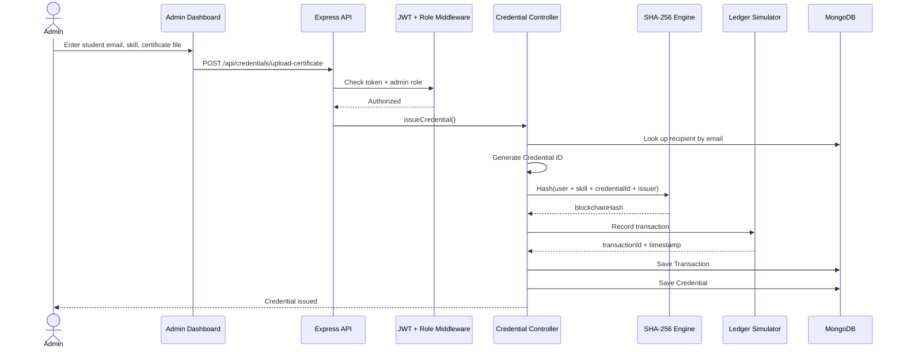
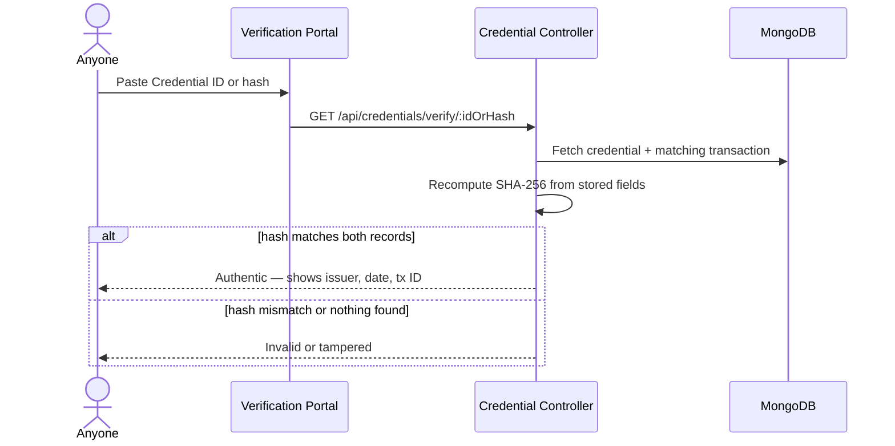
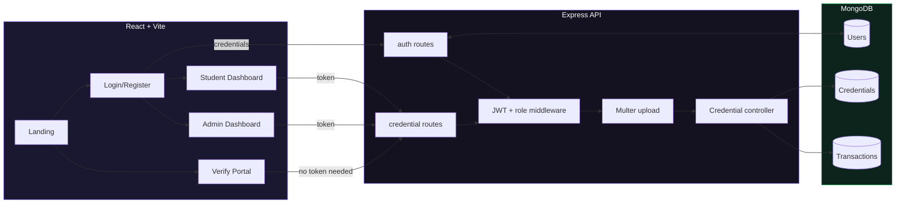
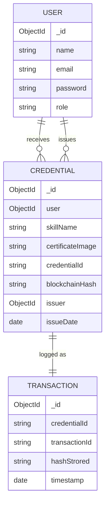

# BlockCred

**A skill credentialing system that proves a credential wasn't tampered with — using SHA-256 hashing and an immutable transaction ledger, MERN stack.**

Admins issue credentials → students collect and share them → anyone can independently verify one is real, without logging in and without trusting a claim on faith.

---

## Why this exists

Certificates get faked, edited, or claimed without proof. BlockCred solves this the way a blockchain would, without the overhead of running one:

1. Every credential's core data (student, skill, issuer, ID) gets hashed with **SHA-256** the moment it's issued.
2. That hash is written twice — once on the credential record, once on a separate, append-only `Transaction` record — mimicking a ledger entry.
3. Verification recomputes the hash from scratch and checks it against both copies. Change one letter of the original data, and the hash won't match — tampering is caught instantly.

No wallet, no gas fees, no external chain — just cryptographic proof, done right.

---

## Who does what

| | |
|---|---|
| **Student** | Registers, logs in, sees every credential they've earned, downloads it as a PDF, shares a verification link |
| **Admin / Issuer** | Logs in, issues a credential to any registered student, optionally attaches a certificate file, sees everything they've issued |
| **Anyone (public)** | Pastes a Credential ID or hash into the verification portal — no account needed — and gets an instant authentic / tampered verdict |

---



## How a credential gets verified



---

## The pieces underneath



---

## Data shape



---

## Stack

- **Frontend** — React 19, Vite, React Router, Axios, Framer Motion, React Hot Toast
- **Backend** — Node.js, Express 5, JWT, bcryptjs, Multer
- **Database** — MongoDB / Mongoose
- **Integrity layer** — Node's built-in `crypto` module (SHA-256)
- **Extras** — jsPDF + html2canvas for PDF export, qrcode.react for shareable codes

---

## API surface

| Method | Route | Who | What |
|---|---|---|---|
| POST | `/api/auth/register` | Anyone | Create an account |
| POST | `/api/auth/login` | Anyone | Get a JWT |
| POST | `/api/credentials/issue` | Admin | Issue a credential, no file |
| POST | `/api/credentials/upload-certificate` | Admin | Issue a credential with a file attached |
| GET | `/api/credentials/my` | Student | List your own credentials |
| GET | `/api/credentials` | Admin | List every credential issued |
| GET | `/api/credentials/verify/:idOrHash` | Anyone | Verify authenticity |
| DELETE | `/api/credentials/:credentialId` | Admin | Remove a credential |

---

## Project layout

```
BlockCred/
├── backend/
│   ├── config/            connect to MongoDB
│   ├── controllers/       authController, credentialController
│   ├── middleware/        JWT + role check, file upload rules
│   ├── models/            User, Credential, Transaction
│   ├── routes/             authRoutes, credentialRoutes
│   └── server.js
│
├── frontend/
│   └── src/
│       ├── pages/          Landing, Login, Register, Dashboard, Verify
│       ├── components/    Navbar, CredentialCard
│       └── services/       api.js
│
└── DEPLOYMENT.md
```

---

## Running it locally

```bash
git clone https://github.com/<your-username>/BlockCred.git
cd BlockCred
npm run install-all
```

Add a `.env` inside `/backend`:

```env
PORT=5000
MONGO_URI=your_mongodb_connection_string
JWT_SECRET=your_jwt_secret
NODE_ENV=development
```

Then, in two terminals:

```bash
# backend
cd backend && npm run dev

# frontend
cd frontend && npm run dev
```

For production: `npm run build` then `npm start`. Deployment notes are in `DEPLOYMENT.md`.

---

## What's next

- Real on-chain verification against a testnet, not just a simulated ledger
- QR-code scan-to-verify
- Email alerts when a credential is issued
- Bulk issuance via CSV
- Credential revocation

---

## Note on the "blockchain" part

This project borrows blockchain's core idea — data integrity through hashing and an append-only record — without actually writing to a public chain. It's built to demonstrate the concept cleanly, not to replace a real distributed ledger.

---

**Author:** Gowthamarajan P — Final-year ECE, V.S.B. Engineering College, Karur
**License:** MIT
